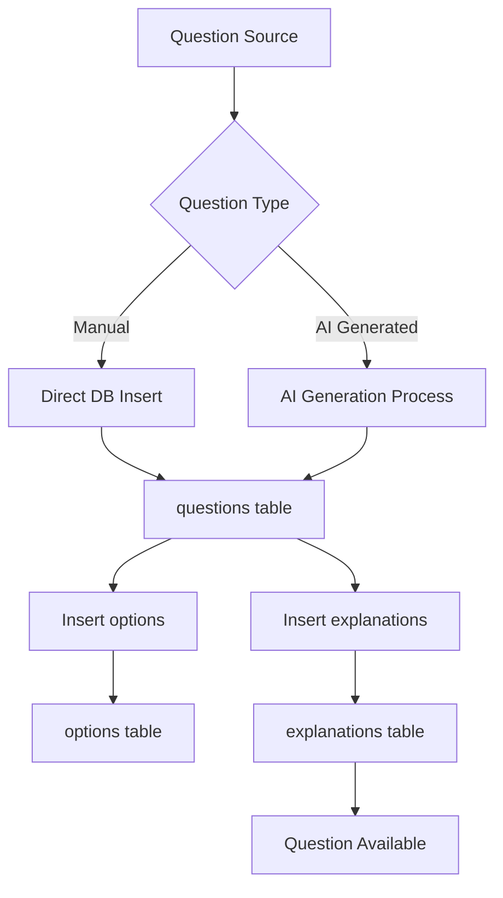
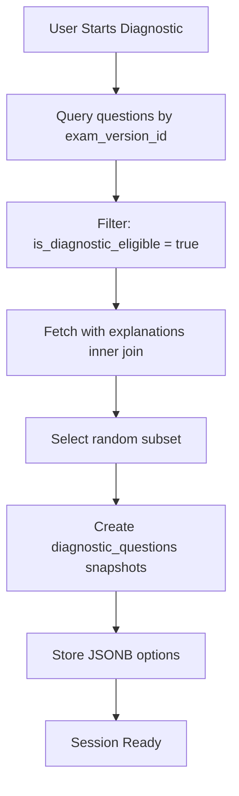

# Question Data Models and Structure

**Document Purpose:** This document explicitly defines the data models, types, and structures used for questions throughout the Testero platform. This serves as the foundation for understanding the question creation pipeline.

**Last Updated:** November 1, 2025

---

## Overview

Testero uses **two distinct question systems** with different data models:

1. **Production Questions** - Stored in normalized relational tables (`questions`, `options`, `explanations`)
2. **Diagnostic Questions** - Snapshotted JSONB format for session persistence (`diagnostic_questions`)

---

## 1. Production Questions System

### Database Schema

#### `questions` Table
The main questions table stores the question stem and metadata.

```sql
-- From lib/supabase/database.types.ts
questions: {
  Row: {
    id: string                        -- UUID primary key
    question_text: string             -- The question stem/prompt
    question_type: string             -- Type identifier (e.g., "multiple_choice")
    certification_id: string | null   -- FK to certifications table
    section_id: string | null         -- FK to certification_sections table
    is_active: boolean | null         -- Whether question is active/published
    generated_at: string | null       -- Timestamp if AI-generated
    created_at: string | null
    updated_at: string | null
  }
}
```

**Field Note:** Despite the database column being `question_text`, the API serialization layer converts this to `stem` for consistency with the diagnostic system.

#### `options` Table
Multiple-choice answer options linked to questions.

```sql
options: {
  Row: {
    id: string                        -- UUID primary key
    question_id: string | null        -- FK to questions.id
    option_text: string               -- The answer option text
    label: string                     -- Display label (A, B, C, D, etc.)
    is_correct: boolean | null        -- Whether this is the correct answer
    explanation: string | null        -- Per-option explanation (deprecated/unused)
    created_at: string | null
    updated_at: string | null
  }
}
```

**Note:** The `explanation` field in options is deprecated. Explanations are now stored in the separate `explanations` table.

#### `explanations` Table
Explanations linked to questions (referenced in code but not in database.types.ts).

```typescript
// Inferred from API usage in app/api/questions/current/route.ts
explanations: {
  Row: {
    id: string
    question_id: string               -- FK to questions.id
    text: string                      -- Explanation text
    // Additional fields likely exist but not documented
  }
}
```

**Business Rule:** Production questions must have at least one explanation to be served to users. The `/api/questions/current` endpoint filters for `explanations!inner(id)` to ensure only questions with explanations are returned.

### TypeScript Types (Frontend)

#### Practice Question Interface
```typescript
// From components/practice/types.ts
export interface Option {
  id: string;
  label: string;      // "A", "B", "C", "D", etc.
  text: string;       // The option text content
}

export interface QuestionData {
  id: string;
  question_text: string;  // Note: Called "stem" in diagnostic system
  options: Option[];
}

export interface QuestionFeedback {
  isCorrect: boolean;
  correctOptionKey: string;    // The label of the correct option
  explanationText: string;
}
```

### API Serialization

Questions are serialized from database format to API format:

```typescript
// From lib/practice/serialize.ts
export function serializeQuestion(
  q: { id: unknown; stem: string },
  options: Array<{ id: unknown; label: string; text: string }>
) {
  return {
    id: String(q.id),              // Ensure string type (avoid bigint issues)
    question_text: q.stem,         // Note: database has question_text, API uses stem
    options: (options || []).map((o) => ({
      id: String(o.id),
      label: o.label,
      text: o.text,
    })),
  };
}
```

**Data Flow:**
1. Database stores `question_text` field
2. Queried as `stem` for consistency
3. Serialized back to `question_text` for API response
4. Frontend components use either `question_text` or `stem` depending on context

---

## 2. Diagnostic Questions System

### Database Schema

Diagnostic questions are **snapshotted** at session creation to ensure consistency even if source questions are modified.

#### `diagnostic_questions` Table
```sql
-- From scripts/create_diagnostic_tables.sql and migration 20250120_add_domain_fields_to_diagnostic_questions.sql
CREATE TABLE diagnostic_questions (
    id UUID PRIMARY KEY DEFAULT uuid_generate_v4(),
    session_id UUID REFERENCES diagnostics_sessions(id) ON DELETE CASCADE,
    original_question_id UUID,        -- Nullable, references questions.id if from main bank
    stem TEXT NOT NULL,               -- Question text/prompt
    options JSONB NOT NULL,           -- Stored as JSONB array
    correct_label TEXT NOT NULL,      -- The label of correct option (e.g., "B")
    domain_id UUID,                   -- Nullable, snapshot of exam_domains.id at question creation time
    domain_code TEXT                  -- Nullable, snapshot of exam_domains.code for quick domain breakdown queries without joins
);
```

**Domain Fields (Canonical Questions):**
- `domain_id` and `domain_code` are snapshots from the canonical `exam_domains` table at the time of diagnostic session creation
- These fields enable domain breakdown calculations directly from `diagnostic_questions` without rejoining canonical tables
- For canonical PMLE questions, these fields are populated from `selectPmleQuestionsByBlueprint()` selection results
- For legacy questions or non-canonical exams, these fields remain `NULL` and the summary endpoint falls back to joining `questions` table to recover `topic` for backward compatibility

#### Options JSONB Structure
```typescript
// The options field stores an array of objects:
options: Array<{
  label: string;    // "A", "B", "C", "D"
  text: string;     // The option text content
}>
```

**Design Decision:** Options are stored as JSONB (denormalized) rather than separate rows because:
- Diagnostic sessions are immutable snapshots
- No need to query individual options
- Simpler session creation logic
- Better performance for session retrieval

#### `diagnostic_responses` Table
User answers to diagnostic questions.

```sql
CREATE TABLE diagnostic_responses (
    id UUID PRIMARY KEY DEFAULT uuid_generate_v4(),
    session_id UUID REFERENCES diagnostics_sessions(id) ON DELETE CASCADE,
    question_id UUID REFERENCES diagnostic_questions(id) ON DELETE CASCADE,
    selected_label TEXT NOT NULL,     -- User's selected option label
    is_correct BOOLEAN NOT NULL,
    responded_at TIMESTAMP WITH TIME ZONE DEFAULT NOW()
);
```

### TypeScript Types

```typescript
// From components/diagnostic/types.ts
export interface QuestionSummary {
  id: string;
  stem: string;                      // Question text
  userAnswer: string;                // Selected label
  correctAnswer: string;             // Correct label
  isCorrect: boolean;
  options: Array<{
    label: string;
    text: string;
  }>;
  domain?: string;                   // Certification section/domain
}
```

### Mock Data Example

```typescript
// From e2e/helpers/mock-data.ts
{
  id: 'test-q1',
  stem: 'What is the primary purpose of feature engineering in machine learning?',
  options: [
    { label: 'A', text: 'To reduce the size of the dataset' },
    { label: 'B', text: 'To transform raw data into meaningful features for ML models' },
    { label: 'C', text: 'To visualize data patterns' },
    { label: 'D', text: 'To store data in databases' }
  ]
}
```

---

## 3. Question Types

### Current Implementation

```typescript
question_type: string    // Stored as TEXT in database
```

**Observed Values:**
- `"multiple_choice"` - Standard multiple choice questions
- (Other types may exist but not documented)

**Future Consideration:** The `question_type` field suggests the system is designed to support multiple question formats, but currently only multiple-choice is implemented.

### Potential Future Types
- `"multi_select"` - Select all that apply
- `"scenario_based"` - Multi-part questions with context
- `"ordering"` - Rank items in correct order
- `"matching"` - Match pairs of items

---

## 4. Question Metadata & Relationships

### Hierarchical Structure

```
certifications (e.g., "Google Professional ML Engineer")
  └── certification_sections (e.g., "ML Problem Framing", "Data Processing")
       └── questions
            ├── options (multiple per question)
            └── explanations (one or more per question)
```

### Related Tables

#### `certifications`
```sql
certifications: {
  Row: {
    id: string
    name: string                     -- e.g., "Google Professional ML Engineer"
    provider: string | null          -- e.g., "Google Cloud"
    created_at: string | null
  }
}
```

#### `certification_sections`
```sql
certification_sections: {
  Row: {
    id: string
    certification_id: string | null  -- FK to certifications.id
    name: string                     -- e.g., "ML Problem Framing"
    description: string | null
    created_at: string | null
  }
}
```

---

## 5. Question Answer Tracking

### Practice Question Responses
```sql
user_question_practice: {
  Row: {
    id: string
    user_id: string | null
    question_id: string | null       -- FK to questions.id
    selected_option_id: string | null -- FK to options.id
    certification_id: string | null
    is_correct: boolean | null
    practiced_at: string | null
    created_at: string | null
  }
}
```

### Test Responses
```sql
user_answers: {
  Row: {
    id: string
    user_id: string | null
    test_id: string | null
    question_id: string | null       -- FK to questions.id
    selected_option_id: string | null -- FK to options.id
    is_correct: boolean | null
    answered_at: string | null
    created_at: string | null
  }
}
```

---

## 6. Data Consistency & Validation

### Required Fields for Production Questions

To be served to users, a production question must have:

✅ `question_text` - Non-empty question stem
✅ `question_type` - Valid type identifier
✅ `is_active = true` - Question is published
✅ **At least 2 options** - One correct, at least one incorrect
✅ **Exactly 1 correct option** - `is_correct = true` for one option only
✅ **At least 1 explanation** - Linked in `explanations` table

### Label Convention

Option labels follow alphabetical convention:
- **Standard:** A, B, C, D (most common)
- **Extended:** A, B, C, D, E, F (for questions with more options)

**Validation Rule:** Labels must be unique within a question and should follow sequential alphabetical order.

---

## 7. Question Creation Data Flow

### Current Flow (Inferred)



### Diagnostic Session Creation



---

## 8. API Endpoints & Question Access

### Practice Questions

**GET `/api/questions/current`**
- Returns one question with rotation logic
- Filters for questions with explanations only
- Returns 404 if no eligible questions exist

**GET `/api/questions/[id]`**
- Returns specific question by ID
- Requires authentication

**POST `/api/questions/submit`**
- Submit answer for a practice question
- Returns feedback with explanation

### Diagnostic Questions

**POST `/api/diagnostic`** (action: "start")
- Creates new diagnostic session
- Snapshots questions to `diagnostic_questions`

**POST `/api/diagnostic`** (action: "answer")
- Submits answer to diagnostic question
- Returns immediate feedback (isCorrect, correctAnswer, explanation)
- **Explanation Source:** The diagnostic answer API uses canonical `public.explanations` as the sole explanation source, queried via `original_question_id` from the question snapshot
- **Missing Explanations:** If a canonical explanation is missing, the `explanation` field in the response will be `null` (rather than a fallback message), and a warning is logged for cleanup
- **Legacy Behavior:** For non-canonical or historical sessions where no canonical explanation exists, the endpoint returns `explanation: null` rather than querying legacy explanation tables

**GET `/api/diagnostic/summary/[sessionId]`**
- Returns complete session results
- Includes all questions with answers

---

## 9. Key Design Decisions

### Why Two Question Systems?

| Aspect | Production Questions | Diagnostic Questions |
|--------|---------------------|---------------------|
| **Storage** | Normalized (questions + options) | Denormalized (JSONB) |
| **Mutability** | Can be edited/updated | Immutable snapshots |
| **Use Case** | Practice, tests, rotation | Diagnostic assessments |
| **Explanation** | Separate table | Fetched on demand |
| **Options** | Separate rows | JSONB array |

### Why `stem` vs `question_text`?

The codebase uses both terms inconsistently:
- **Database:** `question_text` (column name)
- **Diagnostic System:** `stem` (preferred term)
- **API Serialization:** `question_text` (for compatibility)

**Recommendation:** Standardize on `stem` for all new code to match educational testing terminology.

---

## 10. Archive System

### `questions_archive` Table

Legacy/deprecated questions storage:

```sql
questions_archive: {
  Row: {
    id: string
    question: string                 -- Old format question text
    answers: Json                    -- Old format answers array
    correct_answer_index: number     -- Index-based instead of label
    section: string
    created_at: string | null
    updated_at: string | null
  }
}
```

**Migration Status:** Archive format is deprecated. New questions use the normalized `questions` + `options` schema.

---

## 11. Question Quality Requirements

### Content Requirements

1. **Clarity**: Question stem must be unambiguous
2. **Accuracy**: Correct answer must be objectively correct
3. **Plausibility**: Distractors (wrong answers) should be plausible
4. **Relevance**: Must map to certification objectives
5. **Difficulty**: Should align with target certification level

### Technical Requirements

- **Explanation Quality**: Must explain why correct answer is right AND why others are wrong
- **No Giveaways**: Avoid "all of the above" or "none of the above" as correct answers
- **Consistent Length**: Options should be roughly similar in length
- **No Patterns**: Correct answers should be distributed across positions (A, B, C, D)

---

## 12. Future Considerations for Question Pipeline

### Data Needed for Question Creation

To create a complete question, you need:

1. **Question Core**
   - `stem` (question text)
   - `question_type` (e.g., "multiple_choice")
   - `certification_id` (which exam)
   - `section_id` (which domain/topic)

2. **Answer Options** (minimum 2, typically 4)
   - `label` (A, B, C, D)
   - `text` (option content)
   - `is_correct` (true for one, false for others)

3. **Explanation**
   - `text` (comprehensive explanation)
   - Should explain correct answer and common misconceptions

4. **Metadata**
   - `is_active` (publish status)
   - `generated_at` (if AI-generated)
   - `is_diagnostic_eligible` (if suitable for diagnostics)

### Validation Requirements

Before inserting a question:

1. ✅ Verify `certification_id` exists
2. ✅ Verify `section_id` exists and belongs to certification
3. ✅ Ensure exactly one option has `is_correct = true`
4. ✅ Ensure at least 2 options total
5. ✅ Ensure all option labels are unique
6. ✅ Ensure at least one explanation exists
7. ✅ Validate `question_type` is supported

---

## Summary: Question Structure at a Glance

### Minimal Complete Question

```json
{
  "question": {
    "id": "uuid-here",
    "stem": "What is the primary purpose of feature engineering?",
    "question_type": "multiple_choice",
    "certification_id": "google-ml-engineer",
    "section_id": "data-processing",
    "is_active": true
  },
  "options": [
    { "label": "A", "text": "To reduce dataset size", "is_correct": false },
    { "label": "B", "text": "To transform raw data into meaningful features", "is_correct": true },
    { "label": "C", "text": "To visualize patterns", "is_correct": false },
    { "label": "D", "text": "To store data", "is_correct": false }
  ],
  "explanation": {
    "text": "Feature engineering transforms raw data into meaningful features that ML algorithms can use effectively..."
  }
}
```

---

## Next Steps

With this understanding of the question data models, the next phase is to design the **Question Creation Pipeline** which will cover:

1. Question sourcing strategies (manual, AI-generated, imported)
2. Validation and quality control workflows
3. Review and approval processes
4. Batch import capabilities
5. AI assistance for question generation
6. Testing and calibration procedures


